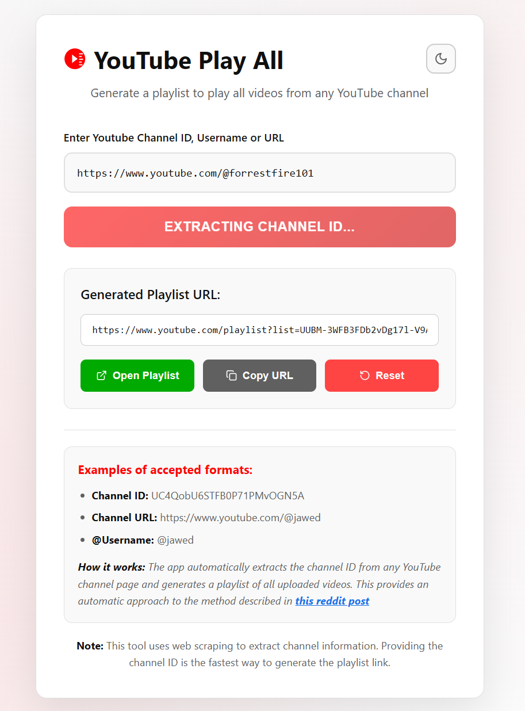

# YouTube Play All

## About

A simple web application that generates a playlist URL to play all videos from any YouTube channel. This tool automatically converts YouTube channel URLs into playlist links that contain all uploaded videos from that channel.

This is made to provide an automatic approach to the method described in<a
                  href="https://www.reddit.com/r/LifeProTips/comments/247c2u/lpt_youtube_how_to_play_all_videos_from_a_channel/"
                  target="_blank"
                  rel="noopener noreferrer"
                  className="reddit-link"
                >
this reddit post
</a> due to Youtube's removal of the "Play All" button.

## How it Works

The app uses a technique discovered on Reddit that converts YouTube channel IDs into playlist IDs:

1. Takes a YouTube channel ID (format: `UCxxxxxxxxxxxxxxxxxx`)
2. Converts it to a playlist ID by changing `UC` to `UU`
3. Generates a playlist URL: `https://www.youtube.com/playlist?list=UUxxxxxxxxxxxxxxxxxx`

## Screenshots

